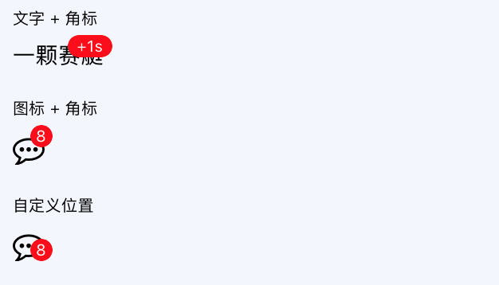

# Badge

**角标**

通常用来显示未读消息数目。

## Demo



## Example

```js
import Badge from 'rnx-ui/Badge';

function Example(props) {
  return (
    <Badge text={8}>
      <Icon name="commenting-o" style={styles.icon} />
    </Badge>
  )
}
```

## Props

```js
Badge.propTypes = {
  // 自定义样式
  style: View.propTypes.style,
  // 自定义文本容器样式
  textContainerStyle: View.propTypes.style,
  // 自定义文本样式
  textStyle: Text.propTypes.style,
  // 角标文本内容
  text: PropTypes.oneOfType([PropTypes.string, PropTypes.number]),
  // 主体元素
  children: PropTypes.oneOfType([PropTypes.element, PropTypes.array]),
};
Badge.defaultProps = {
  style: null,
  textContainerStyle: null,
  textStyle: null,
  text: '',
  children: null,
};
```

## Other Points

- Badge 没有宽度，跨度随外部容器变化
