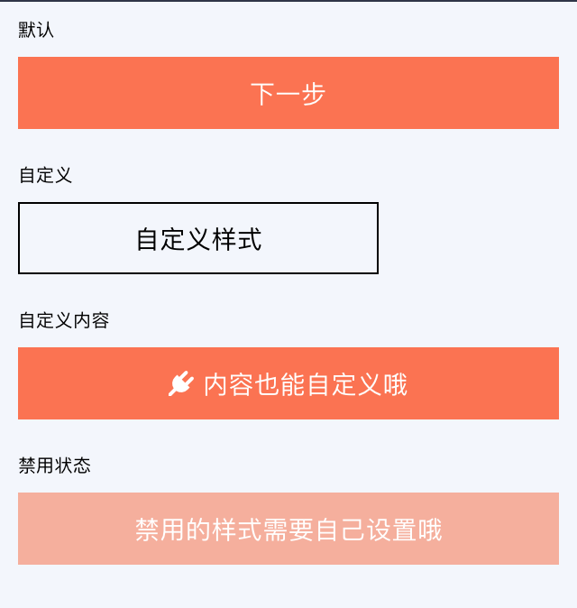

# Btn

**按钮**

## Demo



## Example

```js
import Btn from 'rnx-ui/Btn';

function Example(props) {
  return (
    <Btn>自定义样式</Btn>
  );
}
```

## Props

```js
Btn.propTypes = {
  // 自定义样式
  style: View.propTypes.style,
  // 内部容器样式
  contentContainerStyle: View.propTypes.style,
  // 按钮文本样式（children 为字符串时才生效）
  textStyle: Text.propTypes.style,
  // 点击回调
  onPress: PropTypes.func,
  // 按钮内容
  children: PropTypes.oneOfType([PropTypes.string, PropTypes.element, PropTypes.array]),
  // 点击时透明度反馈
  activeOpacity: PropTypes.number,
  // 是否禁用，为 true 时，activeOpacity 为 1，onPress 为 null
  disabled: PropTypes.bool,
  // 按钮热区
  hitSlop: TouchableOpacity.propTypes.hitSlop,
};
Btn.defaultProps = {
  style: null,
  contentContainerStyle: null,
  textStyle: null,
  onPress: null,
  children: '下一步',
  activeOpacity: ACTIVE_OPACITY,
  disabled: false,
  hitSlop: {},
};
```
