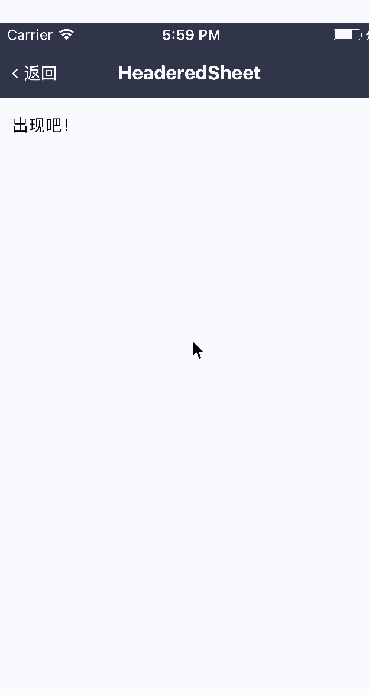

# HeaderedSheet

有标题栏的底部弹层

## Demo



## Document

### Props

```js
HeaderedSheet.propTypes = {
  // 显示开关
  visible: Sheet.propTypes.visible,
  // 遮罩层样式
  modalStyle: Sheet.propTypes.modalStyle,
  // 关闭回调（动画结束时）
  onClose: Sheet.propTypes.onClose,
  // 遮罩点击事件
  onPressModal: Sheet.propTypes.onPressModal,
  // 动画时长
  duration: Sheet.propTypes.duration,
  // 自定容器义样式（包含 header 区域）
  containerStyle: Sheet.propTypes.style,
  // 自定义样式
  style: View.propTypes.style,
  // 自定义 header 样式
  headerStyle: View.propTypes.style,
  // 标题
  title: PropTypes.oneOfType([PropTypes.string, PropTypes.element]),
  // 标题文本样式（title 为字符串时才生效）
  titleStyle: Text.propTypes.style,
  // 标题到左右两边的距离
  titleGap: PropTypes.number,
  // 左侧按钮
  leftBtn: PropTypes.oneOfType([PropTypes.string, PropTypes.element]),
  // 左侧点击事件
  leftEvent: PropTypes.func,
  // 左侧按钮文本样式（leftBtn 为字符串时才生效）
  leftBtnStyle: Text.propTypes.style,
  // 右侧按钮
  rightBtn: PropTypes.oneOfType([PropTypes.string, PropTypes.element]),
  // 右侧点击事件
  rightEvent: PropTypes.func,
  // 右侧按钮文本样式（rightBtn 为字符串时才生效）
  rightBtnStyle: Text.propTypes.style,
  // 按钮点击透明度变化
  activeOpacity: PropTypes.number,
  // 子元素
  children: PropTypes.oneOfType([PropTypes.element, PropTypes.array]),
};
HeaderedSheet.defaultProps = {
  visible: false,
  modalStyle: null,
  onClose: NOOP,
  onPressModal: NOOP,
  duration: 200,
  style: null,
  headerHeight: null,
  title: '',
  titleStyle: null,
  titleGap: 50,
  leftBtn: null,
  leftEvent: NOOP,
  leftBtnStyle: null,
  rightBtn: null,
  rightEvent: NOOP,
  rightBtnStyle: null,
  activeOpacity: 0.6,
  children: null,
};
```
