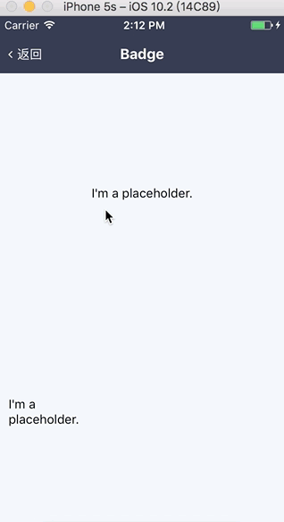

# ImgHolder

**带占位的图片组件**

## Demo



## Props

```js
ImgHolder.propTypes = {
  // 自定义样式
  style: View.propTypes.style,
  // 图片样式
  imgStyle: Image.propTypes.style,
  // 占位元素
  holder: PropTypes.oneOfType([PropTypes.element, PropTypes.array]),
  // 图片资源
  source: PropTypes.oneOfType([PropTypes.object, PropTypes.number]).isRequired,
};
ImgHolder.defaultProps = {
  style: null,
  imgStyle: null,
  holder: null,
  source: {
    uri: '',
  },
};
```
