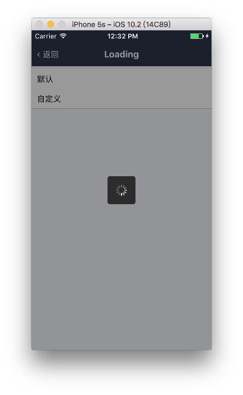

# Loading

菊花加载器

## Demo



## Document

### Props

```js
Loading.propTypes = {
  // 显示开关
  visible: PropTypes.bool.isRequired,
  // 遮罩层样式
  overlayStyle: View.propTypes.style,
  // 菊花容器样式
  loaderStyle: View.propTypes.style,
  // 菊花图标的颜色
  color: ActivityIndicator.propTypes.color,
  // 菊花图标的大小
  size: ActivityIndicator.propTypes.size,
};
Loading.defaultProps = {
  visible: false,
  overlayStyle: null,
  loaderStyle: null,
  color: '#fff',
  size: 'small',
};
```

### Other Points

- 内部封装了 Overlay 组件，请参考 [Other Points - Overlay](https://github.com/dragonwong/rnx-ui/tree/master/Overlay#other-points)
