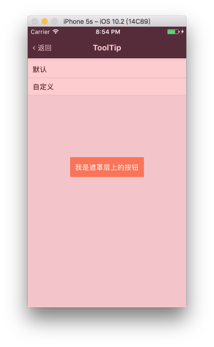

# Overlay

遮罩层

内部封装了 Modal 组件

## Demo



## Document

### Props

```js
Overlay.propTypes = {
  // 显示开关
  visible: PropTypes.bool.isRequired,
  // 点击回调
  onPress: PropTypes.func,
  // 自定义样式
  style: View.propTypes.style,
  // 子元素
  children: PropTypes.oneOfType([PropTypes.element, PropTypes.array]),
};
Overlay.defaultProps = {
  visible: false,
  onPress: NOOP,
  style: null,
  children: null,
};
```

### Other Points

- 因为内部封装的 Modal 组件，会导致该组件会阻止安卓的物理返回键
- 因为内部封装的 Modal 组件，会导致该组件会出现在应用的最顶层。可能需要重点考虑应用存在 Navigator 的情况：尽管 Overlay 写在 Navigator 的某一个场景中，但当该场景被切换时，Overlay 却不会消失。需要在场景结束时手动隐藏该组件。
