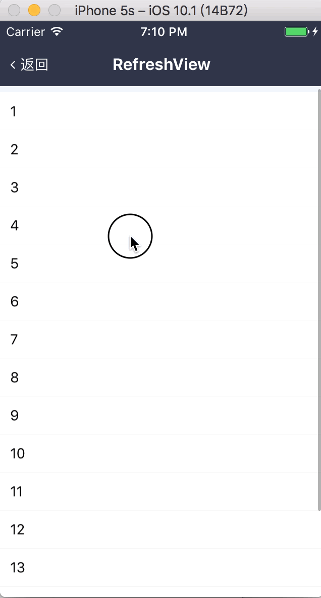

# RefreshView

滚动框

带惯性、下拉刷新功能。官版的 ScrollView 下拉刷新的功能几乎没有可定制空间，而 RefreshView 可以对 RefreshControl 进行完全的自定义，包括控件的本身，下拉状态的实时响应等，具有极大的可定制空间。

配套组件：[RefreshControl](./RefreshControl/README.md)

## Demo



## Document

### Props

```js
RefreshView.propTypes = {
  // 滚动回调，参数为滚动距离
  onScroll: PropTypes.func,
  // 调用 onEndReached 之前的临界值，描述距底部的距离
  onEndReachedThreshold: PropTypes.number,
  // 当滚动至距离底部 onEndReachedThreshold 的范围内，会持续触发的回调
  onEndReached: PropTypes.func,
  // 超出范围时的减速度
  overA: PropTypes.number,
  // 超出范围时最大速度
  maxOverV: PropTypes.number,
  // 拖拽超出范围时的减速度
  dragOverA: PropTypes.number,
  // 渲染间隔时间
  renderInterval: PropTypes.number,
  // 弹性恢复时间
  recoverTime: PropTypes.number,
  // 刷新控件恢复时间
  refreshControlRecoverTime: PropTypes.number,
  // 到达刷新状态所需的距离
  refreshDistance: PropTypes.number,
  // 下拉刷新控件
  refreshControl: (props, propName, componentName) => {
    const type = props[propName].type;
    if (!type || type !== RefreshControl) {
      throw new Error(
        `${componentName}'s props \`refreshControl\` should be an instance of \`RefreshControl\``
      );
    }
  },
  // 子元素
  children: PropTypes.oneOfType([PropTypes.element, PropTypes.array]),
};
RefreshView.defaultProps = {
  onScroll: NOOP,
  onEndReachedThreshold: 0,
  onEndReached: NOOP,
  overA: 0.05,
  maxOverV: 3,
  dragOverA: 2.5,
  renderInterval: 16,
  recoverTime: 200,
  refreshControlRecoverTime: 100,
  refreshDistance: 60,
  refreshControl: null,
  children: null,
};
```

## Todo

1. 初始状态即为 loading 状态
