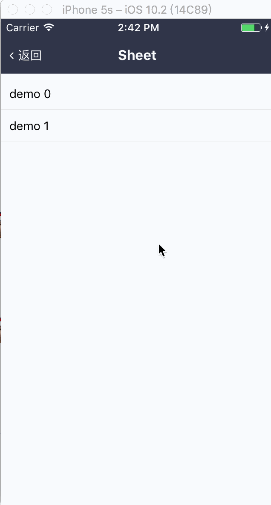

# Sheet

**底部弹层**

底部弹层弹出会有动画。

## Demo



## Props

```js
Sheet.propTypes = {
  // 自定义样式
  style: View.propTypes.style,
  // 显示开关
  visible: PropTypes.bool.isRequired,
  // 遮罩层样式
  overlayStyle: View.propTypes.style,
  // Overlay 动画时长
  overlayAnimationDuration: PropTypes.number,
  // 遮罩点击事件
  onPressOverlay: PropTypes.func,
  // 子元素
  children: PropTypes.oneOfType([PropTypes.element, PropTypes.array]),
  // 动画时长
  duration: PropTypes.number,
  // 显示回调
  onShow: PropTypes.func,
  // 隐藏回调
  onHide: PropTypes.func,
};
Sheet.defaultProps = {
  style: null,
  visible: false,
  overlayStyle: null,
  onPressOverlay: NOOP,
  children: null,
  duration: 200,
  onShow: NOOP,
  onHide: NOOP,
};
```

## Other Points

- 子组件点击事件会穿透从而被遮罩层捕获，如需处理，请在子组件上加上点击事件进行拦截
- 内部封装了 Overlay 组件，请参考 [Overlay](https://github.com/dragonwong/rnx-ui/tree/master/Overlay)
- Sheet 和 Overlay 动画问题：显示时，Sheet 和 Overlay 动画同时开始；隐藏时，Sheet 动画先开始，直至结束，Overlay 动画才开始。

## Todo

- bugfix：`visible` 初始状态为 true 时只有遮罩
