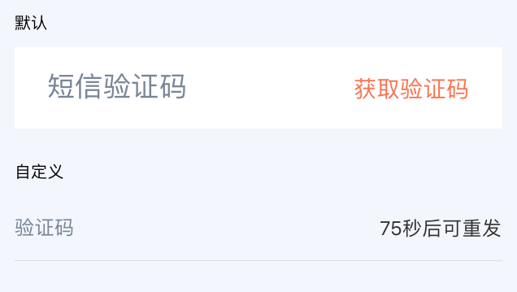

# SmsCaptchaInput

短信验证码输入框

提供发送短信按钮和倒计时功能。

> rnx-ui 表单校验工具 [Validator](https://github.com/dragonwong/rnx-ui/tree/master/util/Validator) 现已支持该组件。

## Demo



## Document

### Props

```js
SmsCaptchaInput.propTypes = {
  // 自定义样式
  style: View.propTypes.style,
  // 自定义输入框样式
  inputStyle: TextInput.propTypes.style,
  // 自定义按钮样式
  buttonStyle: View.propTypes.style,
  // 自定义按钮文本样式
  buttonTextStyle: Text.propTypes.style,
  // 提示文字
  placeholder: PropTypes.string,
  // 提示文字颜色
  placeholderTextColor: PropTypes.string,
  // 按钮点击透明度
  activeOpacity: PropTypes.number,
  // 倒计时时间
  intervalTime: PropTypes.number,
  // 点击发送短信按钮回调，当返回 false 时，可以阻止倒计时开始
  onPressSendMsgBtn: PropTypes.func,
  // 验证码校验长度
  codeLength: PropTypes.number,
  // 校验器接口，值通常为叫校验器的校验手机方法
  collectValidate: PropTypes.func,
  // 用来在校验器中做标识
  name: PropTypes.string,
  // 用来在校验器中组成错误信息
  readableName: PropTypes.string,
  // 改变回调
  onChangeText: PropTypes.func,
};
SmsCaptchaInput.defaultProps = {
  style: null,
  inputStyle: null,
  buttonStyle: null,
  buttonTextStyle: null,
  placeholder: '短信验证码',
  placeholderTextColor: '#798698',
  activeOpacity: 0.6,
  intervalTime: 60,
  onPressSendMsgBtn: NOOP,
  codeLength: 6,
  collectValidate: NOOP,
  name: 'SMS_CODE_INPUT',
  readableName: '短信验证码',
  onChangeText: NOOP,
};
```
