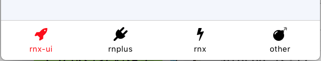

# TabBar

**横向点击栏**

## Demo



## Props

```js
TabBar.propTypes = {
  // 激活项的 Id，必须是 items 项的 id 属性
  activeId: PropTypes.string,
  // 自定义样式
  style: View.propTypes.style,
  // tab 项
  items: PropTypes.arrayOf(PropTypes.shape({
    // tab 项 id
    id: PropTypes.string,
    // tab 项默认元素
    defaultComponent: PropTypes.element,
    // tab 项激活元素
    activedComponent: PropTypes.element,
  })),
  // tab 项点击时透明度
  activeOpacity: PropTypes.number,
  // 改变激活项时的回调，点击项的 id 会作为参数传入。
  onPress: PropTypes.func,
};
TabBar.defaultProps = {
  activeId: '',
  style: null,
  items: [{}],
  activeOpacity: 1,
  onPress: NOOP,
};
```

## Other Points

- TabBar 默认不设高度
- 为防止 `defaultComponent` 和 `activedComponent` 不被刷新，强烈建议加上 `key`
